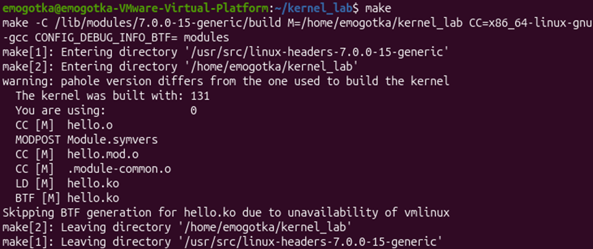
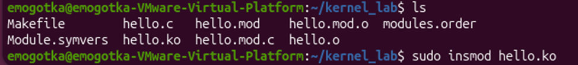
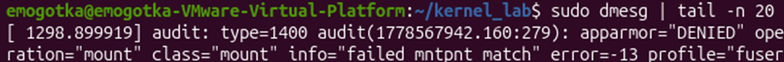
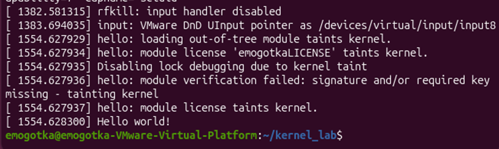
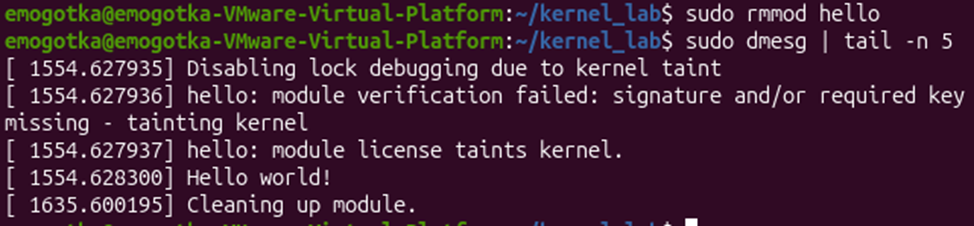

программа выводит hello world в системный лог.
с помощью init переопределяем стандартный способ инициализации модуля. указываем ядру адрес функции, которую нужно вызвать при событии insmod.
с помощью exit переопределяем стандартный способ выгрузки модуля. указываем ядру адрес функции, которую нужно вызвать при событии rmmod.

сборка:

консоль:

...

