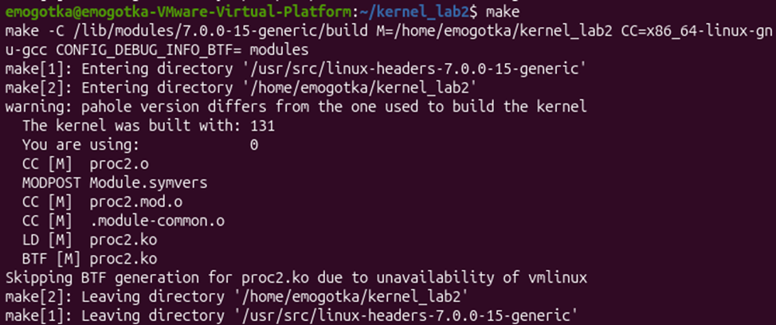
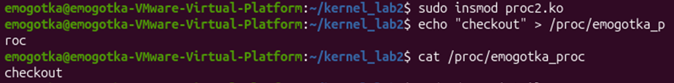

программа создает виртуальный файл в /proc для обмена текстовыми данными между пользователем и ядром.
с помощью структуры операций proc_ops переопределяем стандартный способ чтения из файла. указываем ядру адрес функции, которую нужно вызвать при чтении (cat).
с помощью proc_ops также переопределяем стандартный способ записи в файл. указываем ядру адрес функции, которую нужно вызвать при записи (echo).

сборка:

консоль:
