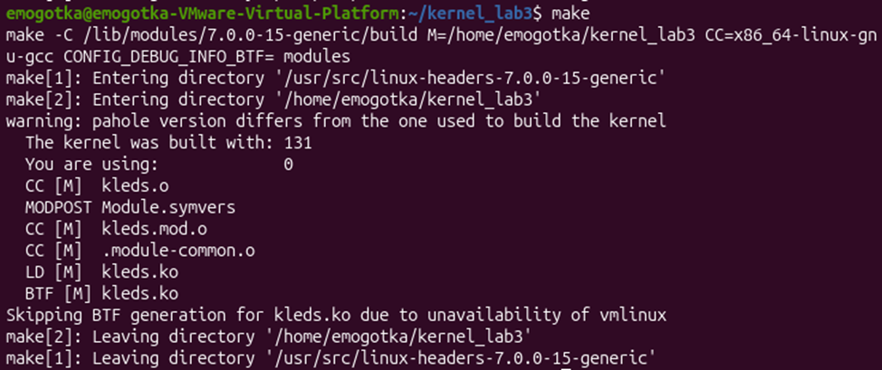

программа создает файл управления в /sys и автоматически мигает светодиодами клавиатуры по таймеру.
с помощью макроса атрибута __ATTR переопределяем стандартный способ записи управляющего параметра в sysfs. указываем ядру адрес функции, которую нужно вызвать при изменении значения файла.
с помощью настройки таймера timer_setup регистрируем обработчик системного времени. указываем ядру адрес функции, которую нужно цикличес    ки вызывать при срабатывания таймера для отправки команды ioctl в терминал.

результат работы программы отправила в кружке в тг

сборка:

