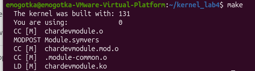
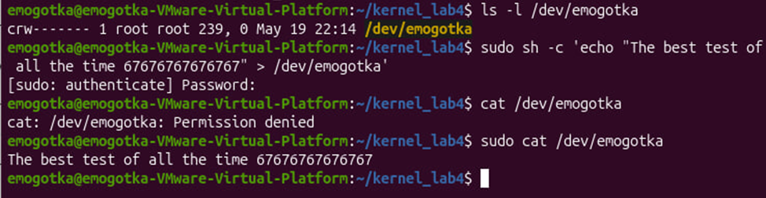

программа автоматически создает файл устройства в /dev и организует простой обмен текстом между пользователем и буфером ядра.
через структуру file_operations мы подменяем стандартные системные действия для этого файла своими функциями. указываем ядру адреса наших функций для чтения и записи. когда пользователь что-то пишет в файл, срабатывает функция copy_from_user, которая переносит строку из памяти пользователя в массив внутри ядра. а когда пользователь читает файл, функция copy_to_user отдает этот текст обратно в терминал, сдвигая указатель, чтобы ядро не выводило повторно текст.

сборка:

консоль:
