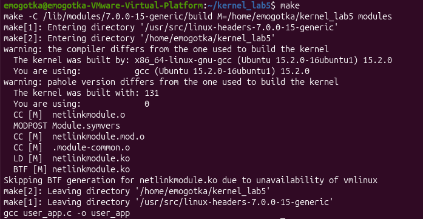
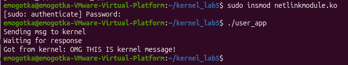

программа открывает прямой сетевой канал внутри системы, через который пользователь и ядро могут без задержек обмениваться сообщениями.
мы настраиваем конфигурацию нетлинка и передаем ядру адрес функции, которую нужно вызывать каждый раз, когда в сокет приходят данные. как только пакет поступает, этот обработчик смотрит в заголовок сетевого буфера, чтобы узнать pid того процесса, который к нему обратился. затем с помощью макроса мы находим в пакете место для текста, пишем туда ответ и отправляем его обратно с помощью функции nlmsg_unicast.

сборка:

консоль:
